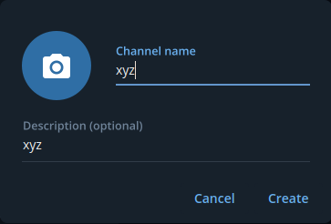

<p align="center">

</p>
<h1 align="center">
<b>Telify</b>
</h1>

Send Files , text and stdin to telegram channels<br/>

[](https://twitter.com/root_tanishq)<br />

<h2><b>What is it for?</h2></b>
I created this basic script for using in automation and to recieve notifications regarding my automation on my telegram mobile app
<br />

<h3><b>Setup</b></h3><br/>

- Search for BotFather on telegram search and type `/start` command to start creating bots
> Telify uses botapi to interact with telegram . So we need to create a telegram bot
- Step 1 > Type `/newbot` command to create a newbot
<br />
- Step 2 > Now you need to provide a *display name* and *username* for bot
> Display Name
<br />
> Username
<br />
> Copy the *HTTP API* Token we will use it with `telify`
- Step 3 > Create a Telegram Channel and add bot as a *member*
<br />

<h3><b>Installation</b></h3><br/>

> Install *telify* with the below commands
```sh
git clone https://github.com/root-tanishq/telify
cd telify
pip3 install -r requirements.txt
sudo cp telify.py /usr/local/bin/telify
sudo chmod +x /usr/local/bin/telify
telify
```
> Enter the *HTTP API* Token of bot created in *Setup Instructions*

<h3><b>Usage</b></h3><br/>

- **Sending a message**
```sh
telify -m '<CUSTOM MESSAGE HERE>'
```
<br />

- **Sending a File**
```sh
telify -f '<FILE NAME HERE>'
```
<br />

- **Sending Std in**
```sh
<YOUR COMMAND> | telify
```
